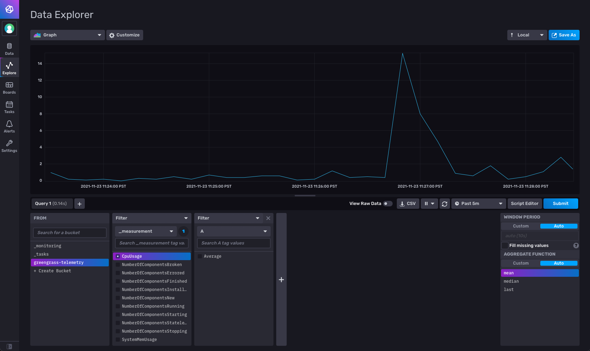

## Greengrass Labs InfluxDB Component - `aws.greengrass.labs.database.InfluxDB`

## Overview
This AWS IoT Greengrass component allows you to provision and manage an [InfluxDB database](https://www.influxdata.com/) on your device.

At a high level, the component will do the following:

1. Pull down the official InfluxDB v2 Docker image from Dockerhub.
2. By default, will create new self-signed certificates and use them for HTTPS. You can toggle on/off both the certificate generation and HTTPS support separately, in case you would like to bring your own certificates to use with HTTPS, or if you would like to just use HTTP.
3. Retrieve a pre-configured secret containing a username and password from AWS Secret Manager via the `aws.greengrass.SecretManager` Greengrass component. These secrets will be used to setup InfluxDB.
3. Create a new InfluxDB container using the self-signed certificates and retrieved username/password, persisting the database by mounting it to a location of your choice on your host machine.
4. Validate the status of the InfluxDB instance.
5. Create a new InfluxDB auth token with read/write bucket privileges, and set up a local IPC pub/sub subscription to a configurable response topic to vend this auth token, along with other InfluxDB metadata.
    * Other Greengrass components on your device can send a pub/sub request to a configurable request topic to retrieve this data, and use it to connect to InfluxDB on their own. If you would like to view an example, see [the `aws.greengrass.labs.telemetry.InfluxDBPublisher` component, which relays Greengrass system health telemetry to InfluxDB](https://github.com/awslabs/aws-greengrass-labs-telemetry-influxdbpublisher).
    
This component works with the `aws.greengrass.labs.dashboard.InfluxDBGrafana`, `aws.greengrass.labs.telemetry.InfluxDBPublisher` and `aws.greengrass.labs.dashboard.Grafana` components to persist and visualize Greengrass System Telemetry data, but can be used on its own or as a primitive for any application.
The `aws.greengrass.labs.dashboard.InfluxDBGrafana` component automates the setup of Grafana with InfluxDB to provide a "one-click" experience, but this component still needs to be configured first before creation. See the `Setup` section below for instructions.

* [aws.greengrass.labs.telemetry.InfluxDBPublisher](https://github.com/awslabs/aws-greengrass-labs-telemetry-influxdbpublisher)
* [aws.greengrass.labs.dashboard.Grafana](https://github.com/awslabs/aws-greengrass-labs-dashboard-grafana)
* [aws.greengrass.labs.dashboard.InfluxDBGrafana](https://github.com/awslabs/aws-greengrass-labs-dashboard-influxdb-grafana)



## Configuration
The `aws.greengrass.labs.database.InfluxDB` component supports the following configuration options. By default, `AutoProvision` is set to `True`, which will require you to provide the configuration for `SecretArn` but leave the remainder of the configuration as the default.

* `AutoProvision` - Retrieves a username/password from Secret Manager in order to provision InfluxDB. If turned off, an InfluxDB instance will still be set up, but you will need to [provision the instance on your own](https://docs.influxdata.com/influxdb/v2.0/install/?t=Docker).
    * (`true`|`false`)
    * default: `true`


* `SecretArn` - The ARN of the AWS Secret Manager secret containing your desired InfluxDB username/password. You must configure and deploy this secret with the [Secret manager component](https://docs.aws.amazon.com/greengrass/v2/developerguide/secret-manager-component.html), and you must specify this secret in the `accessControl` configuration parameter to allow this component to use it.
    * (`string`)
    * default: `arn:aws:secretsmanager:<region>:<account>:secret:<name>`


* `InfluxDBMountPath` - Absolute path of a directory on your host machine that will be used to persist InfluxDB data and certs.
    * (`string`)
    * default: `/home/ggc_user/dashboard`


* `InfluxDBContainerName` - The name of the InfluxDB Docker container.
    * (`string`)
    * default:  `greengrass_InfluxDB`


* `InfluxDBOrg` - The default InfluxDB organization to use.
    * (`string`)
    *  default : `greengrass`


* `InfluxDBBucket` - The default InfluxDB bucket to use to store data.
    * (`string`)
    *  default: `greengrass-telemetry`


* `InfluxDBInterface` - The IP for the InfluxDB container to bind on.
    * (`string`)
    *  default: `127.0.0.1`


* `InfluxDBPort` -The port for the InfluxDB Docker container to bind to.
    *  (`string`)
    * default: `8086`


* `BridgeNetworkName` - The Docker bridge network to create and use for the InfluxDB Docker container.
    * (`string`)
    * default:`greengrass-telemetry-bridge`


* `ServerProtocol`- The protocol to use.
    *  (`https` | `http`)
    *  default: `https`


* `GenerateSelfSignedCert` - Generates self-signed certs for HTTPS if they do not already exist. If set to false while using HTTPS, the component will look for the following two files to use: `{configuration:/InfluxDBMountPath}/influxdb2_certs/influxdb.crt` and `{configuration:/InfluxDBMountPath}/influxdb2_certs/influxdb.key`
    * (`true` | `false` )
    *  default: `true`


* `SkipTLSVerify`: Skip TLS verification (if using self-signed certificates for HTTPS).
    * (`true` | `false` )
    *  default: `true`


* `HTTPSCertExpirationDays` - The number of days you would like the auto-generated self-signed certificates to be valid for.
    * (`string`)
    *  default: `365`


* `TokenRequestTopic` - The local pub/sub topic you would like the component to subscribe to in order to listen for requests for the InfluxDB R/W token.
    * (`string`)
    *  default: `greengrass/influxdb/token/request`
* `TokenResponseTopic` - The local pub/sub topic you would like the component to respond on when handling a request for the InfluxDB R/W token.
    * (`string`)
    *  default: `greengrass/influxdb/token/response`


* `accessControl` - [Greengrass Access Control Policy](https://docs.aws.amazon.com/greengrass/v2/developerguide/interprocess-communication.html#ipc-authorization-policies), required for secret retrieval and pub/sub token vending.
    * A default `accessControl` policy allowing subscribe access to the `greengrass/influxdb/token/request` topic and publish access to the `greengrass/influxdb/token/response` has been included, as well as an incomplete policy for retrieving a secret, which you will need to configure.

## Setup

### Prerequisites

**The following steps are for Ubuntu 20.04 x86_64, but will be similar for most platforms.**

1. Install dependencies on the host machine.
    ```
   sudo apt-get update; sudo apt-get install -y \
     ca-certificates \
     curl \
     gnupg \
     lsb-release \
     zip \
     default-jre \
     python3-pip; \
   python3 -m pip install awsiotsdk influxdb-client
    ```
2. Install Docker on the host machine using [the instructions for Ubuntu](https://docs.docker.com/engine/install/ubuntu/):
   ```
      echo "deb [arch=$(dpkg --print-architecture) signed-by=/usr/share/keyrings/docker-archive-keyring.gpg] https://download.docker.com/linux/ubuntu \ $(lsb_release -cs) stable" | sudo tee /etc/apt/sources.list.d/docker.list > /dev/null
      sudo apt-get update
      sudo apt-get install -y docker-ce docker-ce-cli containerd.io
   ```

3. Setup AWS IoT Greengrass on the host machine [according to the installation instructions](https://docs.aws.amazon.com/greengrass/v2/developerguide/install-greengrass-core-v2.html):
4. Log in as superuser with `sudo su` and then allow `ggc_user:ggc_group` to use Docker, [as per the Docker documentation](https://docs.docker.com/engine/install/linux-postinstall/):
   ```
      sudo usermod -aG docker ggc_user; newgrp docker 
   ```
   Test your access with first `sudo su` and then `su - ggc_user -c "docker ps"`

### Component Setup
1. Install [the Greengrass Development Kit CLI](https://docs.aws.amazon.com/greengrass/v2/developerguide/install-greengrass-development-kit-cli.html) in your local workspace.
    1. Run `python3 -m pip install git+https://github.com/aws-greengrass/aws-greengrass-gdk-cli.git`
2. Pull down the component in a new directory using the GDK CLI.
    ```
   mkdir aws-greengrass-labs-database-influxdb; cd aws-greengrass-labs-database-influxdb
   gdk component init --repository aws-greengrass-labs-database-influxdb 
   ```
3. Create an AWS Secrets Manager Secret to store your InfluxDB username/password.
    1. Go to [AWS Secrets Manager](https://console.aws.amazon.com/secretsmanager/home?region=us-east-1#!/listSecrets):
    2. Create new secret → Other type of Secret → Plaintext. The secret you use should be in the following format:
       ```
       {
        "influxdb_username": "myInfluxDBUsername",
        "influxdb_password": "myInfluxDBPassword123!"
       }
       ```
   Note that your password **must** be at least 16 characters long and must include uppercase and lowercase letters, numbers, and special characters(#$@%+*&!^).

   Note down the ARN of the secrets you just made.

4. Authorize Greengrass to retrieve this secret using IAM:
    1. Follow [the Greengrass documentation](:https://docs.aws.amazon.com/greengrass/v2/developerguide/device-service-role.html) to add authorization
    2. See the [`aws.greengrass.SecretManager` documentation for more information.](https://docs.aws.amazon.com/greengrass/v2/developerguide/secret-manager-component.html)
    3. Your policy should include `secretsmanager:GetSecretValue` for the secret you just created:
    ```
        {
        "Version": "2012-10-17",
        "Statement": [
            {
                "Sid": "VisualEditor1",
                "Effect": "Allow",
                "Action": "secretsmanager:GetSecretValue",
                "Resource": [
                    "<influxDB secret arn>"
                ]
            }
        ]
    }
    ```

5. Create the component:

    1. Modify the `aws.greengrass.labs.database.InfluxDB` recipe at `recipe.yaml`. NOTE: if you would like to specify this configuration during deployment, you can also specify this configuration during a deployment instead (see Step 6).
       1. Replace the two occurrences of `'arn:aws:secretsmanager:region:account:secret:name'` with your created secret ARN, including in the `accessControl` policy.
       2. (Optional) Modify the mount path. The default used will be `/home/ggc_user/dashboard`, **which this component will create for you**.
           1. When specifying a mount path, note that this mount path will be used to store sensitive data, including secrets and certs used for InfluxDB auth. You are responsible for securing this directory on your device. Ensure that `ggc_user:ggc_group` has read/write/execute access to this directory with the following command: `namei -m <path>`.
   
    2. Use the [GDK CLI](https://docs.aws.amazon.com/greengrass/v2/developerguide/greengrass-development-kit-cli.html) to build the component to prepare for publishing.
   ```
   gdk component build
   ```
    4. Use the [GDK CLI](https://docs.aws.amazon.com/greengrass/v2/developerguide/greengrass-development-kit-cli.html) to create a private component.
   ```
   gdk component publish
   ```
7. Create deployment via the AWS CLI or AWS Console, from [Greengrass documentation](https://docs.aws.amazon.com/greengrass/v2/developerguide/create-deployments.html). The following components should be configured in your deployment:
    1. `aws.greengrass.SecretManager`:
   ```
   "cloudSecrets": [
     {
       "arn": "<influxDB secret arn>"
     }
   ]
   ```
    2. If you would like to specify your mount path/Secret Arn/Access Control during deployment instead, ***you must first remove the entire accessControl section from the recipe.yaml file before you create the component***. Then, make sure to merge in the following configuration to your component configuration during deployment.

       Note that specifying a non-default mount path is optional, and omitting it will result in the component using `/home/ggc_user/dashboard` instead.
   ```
       {
       "InfluxDBMountPath": "<Your mount path>" (Optional)
       "SecretArn":  "<Your Secret ARN>",
       "accessControl": {
         "aws.greengrass.SecretManager": {
           "aws.greengrass.labs.database.InfluxDB:secrets:1": {
             "operations": [
               "aws.greengrass#GetSecretValue"
             ],
             "policyDescription": "Allows access to the secret containing InfluxDB credentials.",
             "resources": [
               "<Your Secret ARN>"
             ]
           }
         },
         "aws.greengrass.ipc.pubsub": {
           "aws.greengrass.labs.database.InfluxDB:pubsub:1": {
             "operations": [
               "aws.greengrass#SubscribeToTopic"
             ],
             "policyDescription": "Allows access to subscribe to the token request topic.",
             "resources": [
               "greengrass/influxdb/token/request"
             ]
           },
           "aws.greengrass.labs.database.InfluxDB:pubsub:2": {
             "operations": [
               "aws.greengrass#PublishToTopic"
             ],
             "policyDescription": "Allows access to publish to the token response topic.",
             "resources": [
               "greengrass/influxdb/token/response"
             ]
           }
         }
       }
     }
   ```

8. View the component logs at `/greengrass/v2/logs/aws.greengrass.labs.database.InfluxDB.log`. If correctly set up, you will see the message `InfluxDB has been successfully set up; now listening to token requests` and see logs from InfluxDB as it runs.
    1. If you would like to forward the port from a remote machine, ssh in with the following command to forward the port:
       `ssh -L 8086:localhost:8086 ubuntu@<IP address>`
9. Visit `https://localhost:8086` to view InfluxDB, and login with your username and password.
    1. If using self-signed certificates (the default), you will either need to add trust for these certificates, or possibly use your browser's incognito mode.
       Please see the Troubleshooting section to resolve any issues you may encounter.

## Component Lifecycle Management
* InfluxDB data will be persisted between container restarts and removals since it is mounted to the location of your choice on your host machine.
* Upon start, by default the component will look for the following and create them if they are not present:
    * The docker bridge network `greengrass-telemetry-bridge`
    * The directory `{configuration:/InfluxDBMountPath}/influxdb2_certs` along with a `.cert` and `.key` file for HTTPS
        * By default, this directory has file permissions set to `077` for maximum compatability. [You are responsible for securing file permission on your device](https://docs.aws.amazon.com/greengrass/v2/developerguide/encryption-at-rest.html), and we would recommend scoping these permissions down to fit your use case.
    * The directories `{configuration:/InfluxDBMountPath}/influxdb2/data` to store InfluxDB data and `{configuration:/InfluxDBMountPath}/influxdb2/config` for the InfluxDB config. See more information [on the Dockerhub page](https://hub.docker.com/_/influxdb). These directories are mounted into the container.

## InfluxDB Token Vending
* After initialization and setup, this component will set up a local pub/sub subscription over the Greengrass IPC to vend InfluxDB credentials and metadata to other components that would like to use it to connect to InfluxDB.
    * For more information, see the [Greengrass documentation on local pub/sub](https://docs.aws.amazon.com/greengrass/v2/developerguide/ipc-publish-subscribe.html).
* By default, the request topic is `greengrass/influxdb/token/request`, but can be configured. This component will listen to requests on this topic and respond on the response topic with the requested data.
    * The contents of the JSON request should consist of one of the following:
        * `{"action": "RetrieveToken",  "accessLevel": "RO"}`
            * Retrieve an InfluxDB read-only token along with all necessary metadata.
        * `{"action": "RetrieveToken",  "accessLevel": "RW"}`
            * Retrieve an InfluxDB read/write token along with all necessary metadata.
        * `{"action": "RetrieveToken",  "accessLevel": "Admin"}`
            * Retrieve an InfluxDB admin token along with all necessary metadata.
* By default, the response topic is `/greengrass/influxdb/token/response`, but can be configurable. Responses sent on this topic will be in the following JSON format:
  
    * 
  ```
    {
        InfluxDBContainerName : <influxDB container name>,
        InfluxDBOrg : <influxDB org>,
        InfluxDBBucket : <influxDB bucket>,
        InfluxDBPort : <influxDB port number>,
        InfluxDBInterface: <influxDB bound IP>,
        InfluxDBToken : <token for access to the bucket>,
        InfluxDBServerProtocol <http or https>,
        InfluxDBSkipTLSVerify: <true or false>,
        InfluxDBTokenAccessType: <RO, RW, or admin>
    }
    ```
    * If you would like to view an example of usage, see
        * the [`aws.greengrass.labs.telemetry.InfluxDBPublisher` component, which retrieves a RW token and relays Greengrass system health telemetry to InfluxDB](https://github.com/awslabs/aws-greengrass-labs-telemetry-influxdbpublisher)
        * the [`aws.greengrass.labs.dashboard.InfluxDBGrafana` component, which retrieves a RO token and uses it to automatically connect Grafana with InfluxDB](https://github.com/awslabs/aws-greengrass-labs-dashboard-influxdb-grafana)


## Sending Telemetry to InfluxDB
* The [aws.greengrass.labs.telemetry.InfluxDBPublisher](https://github.com/awslabs/aws-greengrass-labs-telemetry-influxdbpublisher) component, when deployed will forward Greengrass System Telemetry to InfluxDB.
    * See the [Gather system health telemetry data from AWS IoT Greengrass core devices](https://docs.aws.amazon.com/greengrass/v2/developerguide/telemetry.html) documentation page to learn more about system health telemetry
    * Telemetry is retrieved from the [Nucleus Telemetry Emitter component plugin ](https://docs.aws.amazon.com/greengrass/v2/developerguide/nucleus-emitter-component.html) and relayed to InfluxDB.
* To send custom telemetry to InfluxDB, you will need to either use InfluxDB APIs outside of Greengrass, or simply send messages over local pub/sub from a Greengrass component to the topic `$local/greengrass/telemetry`. The [aws.greengrass.labs.telemetry.InfluxDBPublisher](https://github.com/awslabs/aws-greengrass-labs-telemetry-influxdbpublisher) component will automatically forward all telemetry to InfluxDB.
    * [See the aws.greengrass.labs.telemetry.InfluxDBPublisher README](https://github.com/awslabs/aws-greengrass-labs-telemetry-influxdbpublisher/blob/main/README.md)  for more information

## InfluxDB Token creation
This component by default creates and vends the following:
* An InfluxDB admin token, with full access
* An InfluxDB token with RW access to the default bucket
* An InfluxDB token with RO access to the default bucket


If you would like to create other tokens to connect InfluxDB to Grafana or another application, you can do so with the following sample commands that create a separate read-only token that will restrict access. Add `--skip-verify` to these commands only if using self-signed certificates with HTTPS (the default configuration).
Please see the [official InfluxDB token creation documentation](https://docs.influxdata.com/influxdb/cloud/security/tokens/create-token/) for more information.
1. Retrieve the InfluxDB admin token:
```
docker exec -it greengrass_InfluxDB influx auth list --skip-verify
```

2. Retrieve the Bucket ID:

```
docker exec -it greengrass_InfluxDB influx bucket list --name greengrass-telemetry --skip-verify
```

2. Use the admin token to create a read-only token
```
docker exec -it greengrass_InfluxDB influx auth create \
  --read-bucket <bucket ID> --token <admin token> --description "Read-only token" --skip-verify
 ```

## Networking
* Please see the [InfluxDB v2 Configuration Options](https://docs.influxdata.com/influxdb/v2.0/reference/config-options/) for a full list of networking options.
* By default, this component will create a [Docker Bridge Network](https://docs.docker.com/network/bridge/) named `greengrass-telemetry-bridge` for isolation. This also provides easier resolution between this component's container and others such as `aws.greengrass.labs.dashboard.Grafana`.
* The component by default uses self-signed certificates to set up HTTPS with a TLS encryption. They do not allow clients to verify the identity of the InfluxDB server. Please see the [the InfluxDB v2 documentation for TLS encryption](https://docs.influxdata.com/influxdb/v2.0/security/enable-tls/) for more information.
* Please see the configuration options for information on how to change the default port, IP to bind to, bridge network name and http/https, as well as the option to toggle the generation of self-signed certs and TLS verification.


## Resources
* [AWS IoT Greengrass V2 Developer Guide](https://docs.aws.amazon.com/greengrass/v2/developerguide/what-is-iot-greengrass.html)
* [AWS IoT Greengrass V2 Community Components](https://docs.aws.amazon.com/greengrass/v2/developerguide/greengrass-software-catalog.html)
* [AWS IoT Greengrass Development Kit CLI](https://docs.aws.amazon.com/greengrass/v2/developerguide/greengrass-development-kit-cli.html)
* [InfluxDB Dockerhub ](https://hub.docker.com/_/influxdb)
* [InfluxDB v2 Documentation](https://docs.influxdata.com/influxdb/v2.0/)
* [InfluxDB v2 Docker Documentation](https://docs.influxdata.com/influxdb/v2.0/install/?t=Docker)
* [InfluxDB v2 Python Client on Github](https://github.com/influxdata/influxdb-client-python)
* [InfluxDB v2 Configuration Options](https://docs.influxdata.com/influxdb/v2.0/reference/config-options/)

## Container Security
* Greengrass does not manage or distribute the InfluxDB v2 Docker image referenced in this Greengrass component. You are responsible for securing Docker containers on your device and ensuring it does not contain vulnerabilities or security risks.
* HTTPS support is turned on by default; if you would like to use only HTTP, set `ServerProtocol` to `http` in the component configuration.

## Certificate Management and Expiry

* This component by default generates self-signed certificates to use for TLS encryption. We would recommend you sign your certificates with a Certificate Authority as described in [the InfluxDB v2 documentation for TLS encryption](https://docs.influxdata.com/influxdb/v2.0/security/enable-tls/).
* If `GenerateSelfSignedCert` is set to false in the component configuration while using HTTPS, the component will look for the following two files to use, which you can provide:
    * `{configuration:/InfluxDBMountPath}/influxdb2_certs/influxdb.crt`
    * `{configuration:/InfluxDBMountPath}/influxdb2_certs/influxdb.key`
* The HTTPS certificates generated by default will expire in 365 days. If they are removed and the component redeployed or regenerated, new certificates will be created.


## Security

See [CONTRIBUTING](CONTRIBUTING.md#security-issue-notifications) for more information.

## License

This project is licensed under the Apache-2.0 License.

This project also uses but does not distribute the InfluxDBv2 Docker image from Dockerhub, which is under the MIT License. You can view the InfluxDB license [here on Github](https://github.com/influxdata/influxdb/blob/master/LICENSE).

## Troubleshooting


* 
  ```
  Could not import awsiot
  ```
    Ensure that `ggc_user` can import this Python library by running first `sudo su` and then `su - ggc_user -c "python3 -c 'import awsiot'"`

* 
  ```
  mkdir: Operation not permitted
  ```
    Ensure that your mount path has sufficient permission to create and mount directories into the container. If necessary, you can use `RequiresPrivilege: true` in the component recipe's lifecycle to run as root, although this is not recommended.

* 
  ```
  Attempt 0: Waiting until InfluxDB reports a status of OK....
  Error: Get "https://greengrass_InfluxDB:8086/api/v2/setup": dial tcp 172.18.0.2:8086: connect: connection refused..
  ```
    Not necessarily an error - InfluxDB can take a little while to start up. If after repeated retries with the same message the component fails, it means that the container did not start up correctly and exited. View the Docker logs retrieved inside the component log to debug further.

* 
  ```
  aws.greengrass.labs.database.InfluxDB: stderr. Error: open /etc/ssl/greengrass/influxdb.crt: operation not permitted. OR
  aws.greengrass.labs.database.InfluxDB: stderr. Error: open /etc/ssl/greengrass/influxdb.crt: no such file or directory.
  ```
    HTTPS cert file permissions are not permissive enough to allow Docker to mount them/have them be accessible by InfluxDB. Please review your file permissions.
    Logging in as `ggc_user` may be helpful for debugging: `su - ggc_user` or `sudo -u ggc_user -i`
* 
  ```
  ERROR: Max retries exceeded while waiting for InfluxDB to start. Dumping InfluxDB Docker logs and exiting....
  ```
    There was an issue starting the InfluxDB Docker container. Check the log dumps for more information - this is likely due to insufficient file permissions

* 
  ```
  aws.greengrass.labs.database.InfluxDB: stdout. ts=2021-11-11T19:55:59.847535Z lvl=info msg=Unauthorized log_id=0XkE00UW000 error="authorization not found"
  ```
    If you are attempting to connect to InfluxDB or perform an operation, this error can occur due to insufficient token privileges.

* 
  ```
  warn msg="Flux query failed" logger=tsdb.influx_flux err="unauthorized: unauthorized access"
  ```  
    Check that the InfluxDB token used for your request is up to date and replace if necessary.


